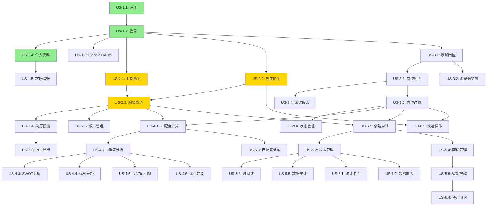

# CareerMatch AI - User Stories & Development Plan

> **版本**: v1.0
> **最后更新**: 2025-01-11

---

## 目录

1. [User Personas](#user-personas)
2. [Epic Stories](#epic-stories)
3. [User Stories with Dependencies](#user-stories-with-dependencies)
4. [Sprint Planning](#sprint-planning)
5. [Story Mapping](#story-mapping)
6. [Acceptance Criteria](#acceptance-criteria)

---

## User Personas

### Persona 1: 应届毕业生 - Emma (Career Starter)

**基本信息**:
- 年龄: 22岁
- 教育: 计算机科学本科毕业
- 经验: 实习经验，首次求职
- 地点: 奥克兰，新西兰

**目标**:
- 找到第一份全职工作
- 展示学习能力和潜力
- 弥补工作经验不足

**痛点**:
- 不知道如何优化简历
- 缺乏面试经验
- 不了解新西兰就业市场
- 难以判断岗位匹配度

**使用场景**:
- 每天浏览20-30个岗位
- 需要针对不同岗位定制简历
- 追踪10-15个申请进度

---

### Persona 2: 职业转换者 - Michael (Career Changer)

**基本信息**:
- 年龄: 32岁
- 教育: 市场营销学位 + 编程训练营
- 经验: 5年市场营销 → 转行软件开发
- 地点: 惠灵顿，新西兰

**目标**:
- 强调可转移技能
- 展示编程能力
- 获得初级开发职位

**痛点**:
- 如何在简历中平衡旧经验和新技能
- 担心年龄和经验不符
- 需要突出项目作品集

**使用场景**:
- 每周申请5-10个精选岗位
- 需要展示个人项目和学习成果
- 关注远程和混合工作机会

---

### Persona 3: 资深专业人士 - Sarah (Experienced Professional)

**基本信息**:
- 年龄: 38岁
- 教育: 软件工程硕士
- 经验: 10年+全栈开发经验
- 地点: 基督城，新西兰

**目标**:
- 寻找高级/架构师职位
- 薪资提升
- 更好的工作生活平衡

**痛点**:
- 简历太长，难以突出重点
- 需要展示领导力和影响力
- 高级职位机会少，需精准匹配

**使用场景**:
- 被动求职，关注高质量机会
- 每周查看2-3个高匹配岗位
- 重视公司文化和团队

---

## Epic Stories

### Epic 1: 用户认证与账户管理 🔐

**业务价值**: 用户能够安全地访问平台并管理个人信息

**User Stories**:
- US-1.1: 用户注册
- US-1.2: 用户登录
- US-1.3: 社交登录（Google）
- US-1.4: 个人资料管理
- US-1.5: 求职偏好设置

**优先级**: P0 (Critical)
**预计时间**: 2 weeks

---

### Epic 2: 简历管理系统 📝

**业务价值**: 用户能够创建、编辑和管理多版本简历

**User Stories**:
- US-2.1: 上传简历（PDF/DOCX）
- US-2.2: 创建新简历
- US-2.3: 编辑简历内容
- US-2.4: 简历预览
- US-2.5: 简历版本管理
- US-2.6: 导出简历为PDF

**优先级**: P0 (Critical)
**预计时间**: 3 weeks

---

### Epic 3: 岗位发现与管理 💼

**业务价值**: 用户能够发现、保存和组织感兴趣的岗位

**User Stories**:
- US-3.1: 手动添加岗位
- US-3.2: 浏览器扩展一键保存岗位
- US-3.3: 岗位列表查看
- US-3.4: 岗位筛选和搜索
- US-3.5: 岗位详情查看
- US-3.6: 岗位状态管理（6种状态）

**优先级**: P0 (Critical)
**预计时间**: 2 weeks

---

### Epic 4: AI智能匹配 🤖

**业务价值**: 用户获得智能的岗位匹配分析，提升求职成功率

**User Stories**:
- US-4.1: 简历与岗位匹配度计算
- US-4.2: 9维度分析展示
- US-4.3: SWOT分析生成
- US-4.4: 优势和差距识别
- US-4.5: 关键词匹配分析
- US-4.6: AI简历优化建议

**优先级**: P1 (High)
**预计时间**: 3 weeks

---

### Epic 5: 申请追踪系统 📊

**业务价值**: 用户能够系统化管理所有申请进度，不错过任何机会

**User Stories**:
- US-5.1: 创建申请记录
- US-5.2: 6种状态管理
- US-5.3: 时间线可视化
- US-5.4: 面试安排管理
- US-5.5: 申请数据统计
- US-5.6: 智能提醒

**优先级**: P1 (High)
**预计时间**: 2 weeks

---

### Epic 6: 求职仪表盘 📈

**业务价值**: 用户能够一目了然地了解求职进展和关键指标

**User Stories**:
- US-6.1: 概览统计卡片
- US-6.2: 申请趋势图表
- US-6.3: 匹配度分布
- US-6.4: 待办事项提醒
- US-6.5: 快速操作入口

**优先级**: P2 (Medium)
**预计时间**: 1 week

---

### Epic 7: 浏览器扩展 🌐

**业务价值**: 用户能够在浏览招聘网站时一键保存岗位

**User Stories**:
- US-7.1: 检测招聘网站
- US-7.2: 提取岗位信息
- US-7.3: 快速匹配预览
- US-7.4: 一键保存到平台
- US-7.5: 支持主流网站（Seek, LinkedIn, TradeMe）

**优先级**: P2 (Medium)
**预计时间**: 2 weeks

---

### Epic 8: AI文档生成 ✍️

**业务价值**: 用户能够使用AI生成高质量的求职文档

**User Stories**:
- US-8.1: 定制简历生成
- US-8.2: 求职信生成
- US-8.3: ATS优化建议
- US-8.4: 面试准备材料

**优先级**: P2 (Medium)
**预计时间**: 2 weeks

---

## User Stories with Dependencies

### Epic 1: 用户认证与账户管理

#### US-1.1: 用户注册

**作为** 新用户
**我想要** 使用邮箱和密码注册账户
**以便于** 开始使用平台功能

**Acceptance Criteria**:
- [ ] 用户可以输入邮箱、密码、姓名
- [ ] 密码强度验证（至少8位，包含字母和数字）
- [ ] 邮箱格式验证
- [ ] 邮箱唯一性检查
- [ ] 注册成功后自动登录
- [ ] 创建用户profile记录
- [ ] 发送欢迎邮件（可选）

**技术任务**:
- [ ] 创建注册表单（React Hook Form + Zod）
- [ ] 集成Supabase Auth注册API
- [ ] 实现表单验证逻辑
- [ ] 创建用户profile触发器
- [ ] 实现自动登录逻辑

**Story Points**: 3
**Priority**: P0
**Dependencies**: None（基础功能）

---

#### US-1.2: 用户登录

**作为** 注册用户
**我想要** 使用邮箱和密码登录
**以便于** 访问我的账户和数据

**Acceptance Criteria**:
- [ ] 用户可以输入邮箱和密码
- [ ] 登录失败显示错误信息
- [ ] 登录成功跳转到仪表盘
- [ ] 保持登录状态（Remember Me）
- [ ] 显示"忘记密码"链接

**技术任务**:
- [ ] 创建登录表单
- [ ] 集成Supabase Auth登录API
- [ ] 实现会话管理
- [ ] 处理登录错误
- [ ] 实现路由保护

**Story Points**: 2
**Priority**: P0
**Dependencies**: US-1.1（注册后才能登录）

---

#### US-1.3: 社交登录（Google OAuth）

**作为** 用户
**我想要** 使用Google账户快速登录
**以便于** 跳过繁琐的注册流程

**Acceptance Criteria**:
- [ ] 显示"使用Google登录"按钮
- [ ] 点击后跳转到Google授权页面
- [ ] 授权成功后创建或登录账户
- [ ] 自动填充用户姓名和头像
- [ ] 绑定Google账户到现有账户（如果邮箱匹配）

**技术任务**:
- [ ] 配置Supabase Google OAuth
- [ ] 创建OAuth按钮组件
- [ ] 处理OAuth回调
- [ ] 实现账户合并逻辑
- [ ] 测试OAuth流程

**Story Points**: 3
**Priority**: P1
**Dependencies**: US-1.1, US-1.2（基础认证完成后）

---

#### US-1.4: 个人资料管理

**作为** 用户
**我想要** 编辑我的个人信息
**以便于** 保持资料最新

**Acceptance Criteria**:
- [ ] 查看当前个人信息
- [ ] 编辑姓名、电话、地点
- [ ] 上传/更换头像
- [ ] 保存修改
- [ ] 显示保存成功提示

**技术任务**:
- [ ] 创建个人资料表单
- [ ] 实现头像上传（Supabase Storage）
- [ ] 更新profiles表
- [ ] 表单验证
- [ ] 成功提示

**Story Points**: 3
**Priority**: P1
**Dependencies**: US-1.2（需要登录后才能编辑）

---

#### US-1.5: 求职偏好设置

**作为** 用户
**我想要** 设置我的求职偏好
**以便于** 获得更精准的推荐

**Acceptance Criteria**:
- [ ] 选择目标职位类型（多选）
- [ ] 选择期望地点（多选）
- [ ] 选择工作类型（全职/兼职/合同等）
- [ ] 设置薪资期望范围
- [ ] 选择远程工作偏好
- [ ] 保存偏好设置

**技术任务**:
- [ ] 创建偏好设置表单
- [ ] 多选组件实现
- [ ] 更新user_preferences表
- [ ] 数据验证
- [ ] 保存成功反馈

**Story Points**: 5
**Priority**: P1
**Dependencies**: US-1.4（个人资料完成后）

---

### Epic 2: 简历管理系统

#### US-2.1: 上传简历（PDF/DOCX）

**作为** 用户
**我想要** 上传现有的简历文件
**以便于** 快速导入我的简历数据

**Acceptance Criteria**:
- [ ] 支持PDF和DOCX格式
- [ ] 文件大小限制（5MB）
- [ ] 上传进度显示
- [ ] 自动解析简历内容
- [ ] 预览解析结果
- [ ] 允许编辑解析后的数据

**技术任务**:
- [ ] 创建文件上传组件
- [ ] 集成Supabase Storage
- [ ] 实现简历解析（pdf-parse, mammoth）
- [ ] 使用GPT-3.5辅助提取结构化数据
- [ ] 创建预览界面
- [ ] 保存到resumes表

**Story Points**: 8
**Priority**: P0
**Dependencies**: US-1.2（需要登录）

---

#### US-2.2: 创建新简历

**作为** 用户
**我想要** 从零开始创建简历
**以便于** 完全掌控简历内容

**Acceptance Criteria**:
- [ ] 提供空白简历模板
- [ ] 包含所有标准章节（个人信息、工作经历、教育背景等）
- [ ] 逐步引导填写
- [ ] 自动保存草稿
- [ ] 可以保存并继续编辑

**技术任务**:
- [ ] 创建简历表单（分步骤）
- [ ] 实现自动保存（debounced）
- [ ] 创建简历数据结构
- [ ] 保存到resumes表
- [ ] 草稿状态管理

**Story Points**: 5
**Priority**: P0
**Dependencies**: US-1.2（需要登录）

---

#### US-2.3: 编辑简历内容

**作为** 用户
**我想要** 编辑已有简历的任何部分
**以便于** 优化简历内容

**Acceptance Criteria**:
- [ ] 查看简历所有章节
- [ ] 点击编辑任意章节
- [ ] 添加/删除条目（工作经历、项目等）
- [ ] 拖拽排序章节
- [ ] 实时预览
- [ ] 保存修改

**技术任务**:
- [ ] 创建富文本编辑器（TipTap或Quill）
- [ ] 实现拖拽排序（@dnd-kit）
- [ ] 实时预览组件
- [ ] 更新resumes表
- [ ] 版本控制（保存历史）

**Story Points**: 8
**Priority**: P0
**Dependencies**: US-2.1 or US-2.2（有简历后才能编辑）

---

#### US-2.4: 简历预览

**作为** 用户
**我想要** 实时预览简历的最终样式
**以便于** 确保简历外观专业

**Acceptance Criteria**:
- [ ] 三栏布局：编辑器 + 预览 + AI建议
- [ ] 预览展示真实PDF样式
- [ ] 支持多种模板切换
- [ ] 实时更新预览
- [ ] 缩放和全屏预览

**技术任务**:
- [ ] 创建预览组件
- [ ] 实现模板系统
- [ ] CSS样式适配
- [ ] 实时同步编辑器和预览
- [ ] 响应式布局

**Story Points**: 5
**Priority**: P1
**Dependencies**: US-2.3（有内容才能预览）

---

#### US-2.5: 简历版本管理

**作为** 用户
**我想要** 管理简历的多个版本
**以便于** 针对不同岗位使用不同版本

**Acceptance Criteria**:
- [ ] 查看所有简历版本
- [ ] 创建新版本（复制现有简历）
- [ ] 为版本命名（如"软件工程师版"）
- [ ] 设置默认简历
- [ ] 删除版本
- [ ] 对比两个版本的差异

**技术任务**:
- [ ] 简历列表页面
- [ ] 复制简历功能
- [ ] 版本命名和管理
- [ ] 默认简历标记
- [ ] 版本对比视图（可选）

**Story Points**: 5
**Priority**: P1
**Dependencies**: US-2.3（有简历后才能版本管理）

---

#### US-2.6: 导出简历为PDF

**作为** 用户
**我想要** 将简历导出为PDF文件
**以便于** 发送给雇主或上传到招聘网站

**Acceptance Criteria**:
- [ ] 点击"导出PDF"按钮
- [ ] 选择模板样式
- [ ] 生成高质量PDF
- [ ] 自动下载文件
- [ ] 文件命名：姓名_简历_日期.pdf

**技术任务**:
- [ ] 集成PDF生成库（react-pdf或puppeteer）
- [ ] 创建PDF模板
- [ ] 实现导出逻辑
- [ ] 文件下载处理
- [ ] 测试PDF质量

**Story Points**: 5
**Priority**: P1
**Dependencies**: US-2.4（预览完成后）

---

### Epic 3: 岗位发现与管理

#### US-3.1: 手动添加岗位

**作为** 用户
**我想要** 手动添加看到的岗位信息
**以便于** 集中管理所有感兴趣的岗位

**Acceptance Criteria**:
- [ ] 点击"添加岗位"按钮
- [ ] 填写岗位信息（标题、公司、描述、要求等）
- [ ] 可选字段：薪资、地点、截止日期、来源URL
- [ ] 表单验证
- [ ] 保存后显示在岗位列表

**技术任务**:
- [ ] 创建岗位表单
- [ ] 表单验证（React Hook Form + Zod）
- [ ] 保存到jobs表
- [ ] 成功反馈
- [ ] 跳转到岗位详情

**Story Points**: 3
**Priority**: P0
**Dependencies**: US-1.2（需要登录）

---

#### US-3.2: 浏览器扩展一键保存岗位

**作为** 用户
**我想要** 在招聘网站上一键保存岗位
**以便于** 快速收集岗位信息

**Acceptance Criteria**:
- [ ] 安装Chrome扩展
- [ ] 在Seek/LinkedIn/TradeMe页面显示保存按钮
- [ ] 自动提取岗位信息
- [ ] 显示提取预览
- [ ] 一键保存到平台
- [ ] 显示保存成功提示

**技术任务**:
- [ ] 开发Chrome Extension（Manifest V3）
- [ ] 实现网页信息提取（content script）
- [ ] 配置网站选择器
- [ ] 与主应用通信
- [ ] 保存到jobs表

**Story Points**: 13
**Priority**: P2
**Dependencies**: US-3.1（岗位表结构完成）

---

#### US-3.3: 岗位列表查看

**作为** 用户
**我想要** 查看所有保存的岗位
**以便于** 快速浏览和管理

**Acceptance Criteria**:
- [ ] 列表显示所有岗位
- [ ] 每个岗位显示：标题、公司、地点、状态、匹配度
- [ ] 卡片式布局
- [ ] 点击查看详情
- [ ] 显示岗位数量统计

**技术任务**:
- [ ] 创建岗位列表组件
- [ ] 从jobs表获取数据
- [ ] 卡片组件设计
- [ ] 分页或无限滚动
- [ ] 加载状态处理

**Story Points**: 3
**Priority**: P0
**Dependencies**: US-3.1（有岗位数据后）

---

#### US-3.4: 岗位筛选和搜索

**作为** 用户
**我想要** 筛选和搜索岗位
**以便于** 快速找到特定岗位

**Acceptance Criteria**:
- [ ] 搜索框（按标题、公司搜索）
- [ ] 筛选器：状态、工作类型、地点
- [ ] 排序：最新、匹配度、截止日期
- [ ] 实时筛选
- [ ] 显示筛选结果数量
- [ ] 清除筛选按钮

**技术任务**:
- [ ] 创建搜索和筛选UI
- [ ] 实现前端筛选逻辑
- [ ] 或实现后端筛选API
- [ ] 筛选状态管理（Zustand）
- [ ] URL参数同步

**Story Points**: 5
**Priority**: P1
**Dependencies**: US-3.3（列表完成后）

---

#### US-3.5: 岗位详情查看

**作为** 用户
**我想要** 查看岗位的完整信息
**以便于** 深入了解岗位要求

**Acceptance Criteria**:
- [ ] 显示完整岗位信息
- [ ] 三个标签页：岗位信息、匹配分析、生成文档
- [ ] 岗位信息标签：描述、要求、福利、公司信息
- [ ] 可以编辑岗位信息
- [ ] 显示来源链接（可跳转）

**技术任务**:
- [ ] 创建岗位详情页面
- [ ] 实现标签页切换
- [ ] 岗位信息展示
- [ ] 编辑模式切换
- [ ] 更新jobs表

**Story Points**: 5
**Priority**: P0
**Dependencies**: US-3.3（列表中点击进入）

---

#### US-3.6: 岗位状态管理

**作为** 用户
**我想要** 更新岗位的申请状态
**以便于** 追踪求职进度

**Acceptance Criteria**:
- [ ] 6种状态：已保存、已申请、面试中、已拒绝、已录取、已撤回
- [ ] 在列表页快速更改状态（下拉菜单）
- [ ] 在详情页更改状态
- [ ] 状态颜色编码
- [ ] 状态变更历史记录

**技术任务**:
- [ ] 创建状态下拉组件
- [ ] 状态更新API
- [ ] 更新jobs表status字段
- [ ] 状态变更通知
- [ ] 状态历史记录

**Story Points**: 3
**Priority**: P0
**Dependencies**: US-3.5（详情页完成）

---

### Epic 4: AI智能匹配

#### US-4.1: 简历与岗位匹配度计算

**作为** 用户
**我想要** 看到简历与岗位的匹配度评分
**以便于** 判断是否值得申请

**Acceptance Criteria**:
- [ ] 选择简历和岗位
- [ ] 计算0-100分匹配度
- [ ] 显示匹配徽章（颜色编码）
- [ ] 缓存匹配结果（避免重复计算）
- [ ] 计算时间<5秒

**技术任务**:
- [ ] 集成OpenAI API（GPT-4）
- [ ] 设计匹配算法prompt
- [ ] 实现匹配计算逻辑
- [ ] 保存到job_analyses表
- [ ] 显示匹配徽章组件

**Story Points**: 8
**Priority**: P1
**Dependencies**: US-2.3（有简历）+ US-3.5（有岗位）

---

#### US-4.2: 9维度分析展示

**作为** 用户
**我想要** 看到详细的9维度匹配分析
**以便于** 了解匹配的具体方面

**Acceptance Criteria**:
- [ ] 显示9个维度：角色定位、技能要求、经验匹配、教育背景、行业匹配、软技能、公司文化、成长潜力、薪酬期望
- [ ] 每个维度0-100分评分
- [ ] 雷达图可视化
- [ ] 每个维度的详细说明
- [ ] 突出优势和劣势维度

**技术任务**:
- [ ] OpenAI生成9维度分析
- [ ] 创建雷达图组件（Recharts）
- [ ] 维度说明展示
- [ ] 保存分析结果
- [ ] 响应式图表

**Story Points**: 8
**Priority**: P1
**Dependencies**: US-4.1（匹配度计算完成）

---

#### US-4.3: SWOT分析生成

**作为** 用户
**我想要** 看到我的SWOT分析
**以便于** 了解优势、劣势、机会和威胁

**Acceptance Criteria**:
- [ ] 生成SWOT矩阵
- [ ] 每个象限3-5个要点
- [ ] 2x2矩阵布局
- [ ] 清晰的图标和颜色
- [ ] 可打印/导出

**技术任务**:
- [ ] OpenAI生成SWOT内容
- [ ] 创建SWOT矩阵组件
- [ ] 保存到job_analyses
- [ ] 样式设计
- [ ] 导出功能（可选）

**Story Points**: 5
**Priority**: P2
**Dependencies**: US-4.2（分析完成后）

---

#### US-4.4: 优势和差距识别

**作为** 用户
**我想要** 清楚地看到我的优势和差距
**以便于** 准备申请材料

**Acceptance Criteria**:
- [ ] 列出3-5个主要优势
- [ ] 列出3-5个主要差距
- [ ] 每个要点有解释
- [ ] 差距提供改进建议
- [ ] 优势突出展示

**技术任务**:
- [ ] 从AI分析提取优势和差距
- [ ] 创建展示组件
- [ ] 改进建议生成
- [ ] 保存到job_analyses

**Story Points**: 3
**Priority**: P1
**Dependencies**: US-4.2（分析完成后）

---

#### US-4.5: 关键词匹配分析

**作为** 用户
**我想要** 看到简历与岗位的关键词匹配情况
**以便于** 优化简历关键词

**Acceptance Criteria**:
- [ ] 提取岗位关键词
- [ ] 标记简历中已包含的关键词
- [ ] 标记缺失的关键词
- [ ] 关键词重要性分级（高/中/低）
- [ ] 建议添加的关键词位置

**技术任务**:
- [ ] 使用GPT-3.5提取关键词
- [ ] 关键词匹配算法
- [ ] 创建关键词展示组件
- [ ] 高亮简历中的关键词
- [ ] 保存到job_analyses

**Story Points**: 5
**Priority**: P1
**Dependencies**: US-4.2（分析完成后）

---

#### US-4.6: AI简历优化建议

**作为** 用户
**我想要** 获得AI提供的简历优化建议
**以便于** 提升简历质量

**Acceptance Criteria**:
- [ ] 针对当前岗位的优化建议
- [ ] 分类建议：内容、格式、关键词、量化
- [ ] 每条建议有具体示例
- [ ] 一键应用建议（可选）
- [ ] 建议优先级排序

**技术任务**:
- [ ] GPT-4生成优化建议
- [ ] 建议分类和排序
- [ ] 创建建议展示组件
- [ ] 应用建议到简历（可选）
- [ ] 保存建议历史

**Story Points**: 8
**Priority**: P2
**Dependencies**: US-4.2（分析完成后）

---

### Epic 5: 申请追踪系统

#### US-5.1: 创建申请记录

**作为** 用户
**我想要** 记录我的每一次申请
**以便于** 追踪所有申请

**Acceptance Criteria**:
- [ ] 从岗位详情页创建申请
- [ ] 选择使用的简历版本
- [ ] 初始状态：草稿或已提交
- [ ] 记录提交日期
- [ ] 可添加备注

**技术任务**:
- [ ] 创建申请表单
- [ ] 保存到applications表
- [ ] 关联job_id和resume_id
- [ ] 初始化timeline
- [ ] 成功反馈

**Story Points**: 3
**Priority**: P1
**Dependencies**: US-2.3（有简历）+ US-3.5（有岗位）

---

#### US-5.2: 6种状态管理

**作为** 用户
**我想要** 更新申请的状态
**以便于** 反映真实进展

**Acceptance Criteria**:
- [ ] 6种状态：草稿、已提交、审核中、面试安排、录取、拒绝
- [ ] 状态下拉菜单
- [ ] 状态变更自动记录到时间线
- [ ] 状态颜色编码
- [ ] 状态变更通知（可选）

**技术任务**:
- [ ] 创建状态管理组件
- [ ] 更新applications表
- [ ] 自动添加时间线事件
- [ ] 状态变更通知
- [ ] 状态统计

**Story Points**: 5
**Priority**: P1
**Dependencies**: US-5.1（创建申请后）

---

#### US-5.3: 时间线可视化

**作为** 用户
**我想要** 看到申请的完整时间线
**以便于** 了解申请历史

**Acceptance Criteria**:
- [ ] 垂直时间线展示
- [ ] 显示所有事件（提交、查看、面试等）
- [ ] 每个事件有日期、类型、描述
- [ ] 可以手动添加事件
- [ ] 时间线可折叠/展开

**技术任务**:
- [ ] 创建时间线组件
- [ ] 从applications.timeline读取数据
- [ ] 事件类型图标映射
- [ ] 添加事件功能
- [ ] 更新timeline字段

**Story Points**: 5
**Priority**: P1
**Dependencies**: US-5.2（有状态变更记录）

---

#### US-5.4: 面试安排管理

**作为** 用户
**我想要** 记录和管理面试安排
**以便于** 不错过任何面试

**Acceptance Criteria**:
- [ ] 添加面试（日期、时间、类型、地点）
- [ ] 面试类型：电话、视频、现场、技术、行为、终面
- [ ] 面试倒计时显示
- [ ] 面试准备材料附件
- [ ] 面试后记录反馈

**技术任务**:
- [ ] 创建面试表单
- [ ] 保存到interviews表
- [ ] 日期时间选择器
- [ ] 倒计时组件
- [ ] 附件上传（Supabase Storage）

**Story Points**: 8
**Priority**: P1
**Dependencies**: US-5.1（申请记录完成）

---

#### US-5.5: 申请数据统计

**作为** 用户
**我想要** 看到我的申请统计数据
**以便于** 了解求职表现

**Acceptance Criteria**:
- [ ] 总申请数
- [ ] 各状态分布（饼图或柱状图）
- [ ] 平均响应时间
- [ ] 面试转化率
- [ ] 时间趋势图（每周申请数）

**技术任务**:
- [ ] 编写统计查询（SQL或Supabase函数）
- [ ] 创建图表组件（Recharts）
- [ ] 计算转化率
- [ ] 时间序列处理
- [ ] 响应式图表

**Story Points**: 5
**Priority**: P2
**Dependencies**: US-5.2（有足够的申请数据）

---

#### US-5.6: 智能提醒

**作为** 用户
**我想要** 收到申请相关的提醒
**以便于** 及时跟进

**Acceptance Criteria**:
- [ ] 截止日期临近提醒（3天前）
- [ ] 面试前1天提醒
- [ ] 长时间无回复提醒（2周）
- [ ] 提醒在应用内显示
- [ ] 邮件提醒（可选）

**技术任务**:
- [ ] 设计提醒规则
- [ ] 定时任务（Supabase Edge Function或Cron）
- [ ] 创建通知表
- [ ] 应用内通知组件
- [ ] 邮件发送（可选）

**Story Points**: 8
**Priority**: P2
**Dependencies**: US-5.4（面试管理完成）

---

### Epic 6: 求职仪表盘

#### US-6.1: 概览统计卡片

**作为** 用户
**我想要** 在仪表盘看到关键指标
**以便于** 快速了解求职状态

**Acceptance Criteria**:
- [ ] 4个统计卡片：总申请、面试中、录取、拒绝
- [ ] 每个卡片显示数字和趋势（↑↓）
- [ ] 卡片可点击查看详情
- [ ] 实时更新数据

**技术任务**:
- [ ] 创建统计卡片组件
- [ ] 获取统计数据API
- [ ] 计算趋势（与上周对比）
- [ ] 卡片点击跳转
- [ ] 数据刷新

**Story Points**: 3
**Priority**: P2
**Dependencies**: US-5.2（有申请数据）

---

#### US-6.2: 申请趋势图表

**作为** 用户
**我想要** 看到申请趋势图
**以便于** 了解求职活跃度

**Acceptance Criteria**:
- [ ] 折线图或柱状图
- [ ] 显示最近30天的申请数
- [ ] 可切换时间范围（7天、30天、90天）
- [ ] 鼠标悬停显示详情
- [ ] 响应式图表

**技术任务**:
- [ ] 创建图表组件（Recharts）
- [ ] 时间序列数据处理
- [ ] 时间范围切换
- [ ] 工具提示
- [ ] 响应式布局

**Story Points**: 5
**Priority**: P2
**Dependencies**: US-5.2（有申请数据）

---

#### US-6.3: 匹配度分布

**作为** 用户
**我想要** 看到我申请的岗位匹配度分布
**以便于** 评估申请质量

**Acceptance Criteria**:
- [ ] 显示匹配度分布（如：<60分、60-80分、>80分）
- [ ] 饼图或环形图
- [ ] 显示每个区间的岗位数量
- [ ] 可点击查看对应岗位列表

**技术任务**:
- [ ] 获取匹配度数据
- [ ] 分组统计
- [ ] 创建饼图组件
- [ ] 点击事件处理
- [ ] 筛选跳转

**Story Points**: 3
**Priority**: P2
**Dependencies**: US-4.1（有匹配度数据）

---

#### US-6.4: 待办事项提醒

**作为** 用户
**我想要** 在仪表盘看到待办事项
**以便于** 不错过重要任务

**Acceptance Criteria**:
- [ ] 显示待办列表（截止日期临近、面试准备、跟进提醒）
- [ ] 按优先级排序
- [ ] 可标记为完成
- [ ] 点击跳转到相关页面
- [ ] 显示待办数量徽章

**技术任务**:
- [ ] 计算待办事项逻辑
- [ ] 创建待办列表组件
- [ ] 优先级排序
- [ ] 完成标记
- [ ] 跳转链接

**Story Points**: 5
**Priority**: P2
**Dependencies**: US-5.6（提醒系统完成）

---

#### US-6.5: 快速操作入口

**作为** 用户
**我想要** 从仪表盘快速进入常用功能
**以便于** 提高效率

**Acceptance Criteria**:
- [ ] 快速操作按钮：添加岗位、创建简历、查看申请
- [ ] 最近查看的岗位（快速访问）
- [ ] 推荐岗位（基于偏好）
- [ ] 一键操作无需跳转

**技术任务**:
- [ ] 创建快速操作组件
- [ ] 最近访问记录
- [ ] 推荐算法（简单版）
- [ ] 模态框快速操作
- [ ] 本地存储最近访问

**Story Points**: 5
**Priority**: P2
**Dependencies**: US-3.5, US-2.2（基础功能完成）

---

## Sprint Planning

### Sprint 1 (Week 1-2): 基础设施与认证

**目标**: 完成用户认证系统，为后续功能打好基础

**User Stories**:
- US-1.1: 用户注册 (3 points)
- US-1.2: 用户登录 (2 points)
- US-1.4: 个人资料管理 (3 points)

**总Story Points**: 8
**Sprint目标**: 用户能够注册、登录和管理个人信息

**验收标准**:
- [ ] 用户可以成功注册账户
- [ ] 用户可以登录并看到个人仪表盘
- [ ] 用户可以编辑个人资料和上传头像

---

### Sprint 2 (Week 3-4): 简历基础功能

**目标**: 实现简历创建、编辑和预览

**User Stories**:
- US-2.1: 上传简历 (8 points)
- US-2.2: 创建新简历 (5 points)
- US-2.3: 编辑简历内容 (8 points)

**总Story Points**: 21
**Sprint目标**: 用户能够上传、创建和编辑简历

**验收标准**:
- [ ] 用户可以上传PDF/DOCX简历并自动解析
- [ ] 用户可以从零创建新简历
- [ ] 用户可以编辑简历的任何部分

---

### Sprint 3 (Week 5-6): 岗位管理

**目标**: 实现岗位添加、查看和管理

**User Stories**:
- US-3.1: 手动添加岗位 (3 points)
- US-3.3: 岗位列表查看 (3 points)
- US-3.4: 岗位筛选和搜索 (5 points)
- US-3.5: 岗位详情查看 (5 points)
- US-3.6: 岗位状态管理 (3 points)

**总Story Points**: 19
**Sprint目标**: 用户能够添加、查看和管理岗位

**验收标准**:
- [ ] 用户可以手动添加岗位
- [ ] 用户可以查看岗位列表并筛选搜索
- [ ] 用户可以查看岗位详情并更新状态

---

### Sprint 4 (Week 7-8): AI匹配分析

**目标**: 实现AI驱动的简历岗位匹配

**User Stories**:
- US-4.1: 匹配度计算 (8 points)
- US-4.2: 9维度分析 (8 points)
- US-4.4: 优势和差距 (3 points)
- US-4.5: 关键词匹配 (5 points)

**总Story Points**: 24
**Sprint目标**: 用户能够获得智能的匹配分析

**验收标准**:
- [ ] 用户可以看到简历与岗位的匹配度评分
- [ ] 用户可以查看详细的9维度分析和雷达图
- [ ] 用户可以看到关键词匹配情况

---

### Sprint 5 (Week 9-10): 申请追踪

**目标**: 实现完整的申请追踪系统

**User Stories**:
- US-5.1: 创建申请记录 (3 points)
- US-5.2: 状态管理 (5 points)
- US-5.3: 时间线可视化 (5 points)
- US-5.4: 面试管理 (8 points)

**总Story Points**: 21
**Sprint目标**: 用户能够追踪申请进度和面试

**验收标准**:
- [ ] 用户可以创建和管理申请记录
- [ ] 用户可以更新申请状态并查看时间线
- [ ] 用户可以记录和管理面试安排

---

### Sprint 6 (Week 11-12): 仪表盘与优化

**目标**: 完成仪表盘并优化用户体验

**User Stories**:
- US-1.3: Google OAuth (3 points)
- US-1.5: 求职偏好 (5 points)
- US-6.1: 统计卡片 (3 points)
- US-6.2: 趋势图表 (5 points)
- US-6.4: 待办事项 (5 points)
- US-2.4: 简历预览 (5 points)
- US-2.6: PDF导出 (5 points)

**总Story Points**: 31
**Sprint目标**: 完善用户体验和数据可视化

**验收标准**:
- [ ] 用户可以使用Google快速登录
- [ ] 用户可以在仪表盘看到关键指标和趋势
- [ ] 用户可以导出PDF简历

---

## Story Mapping

### 用户旅程地图

```
用户注册 → 创建简历 → 发现岗位 → 分析匹配 → 申请岗位 → 追踪进度 → 获得录取
   ↓          ↓          ↓          ↓          ↓          ↓          ↓
US-1.1     US-2.1     US-3.1     US-4.1     US-5.1     US-5.2     US-5.4
US-1.2     US-2.2     US-3.3     US-4.2     US-5.3     US-5.5     US-5.6
US-1.4     US-2.3     US-3.5     US-4.5     US-5.4     US-6.1
                      US-3.6                          US-6.2
```

---

## Dependency Graph



---

## Acceptance Criteria Template

每个User Story都应包含INVEST原则：

- **I**ndependent（独立的）
- **N**egotiable（可协商的）
- **V**aluable（有价值的）
- **E**stimable（可估算的）
- **S**mall（小的）
- **T**estable（可测试的）

### 验收标准格式

```markdown
Given [前置条件]
When [用户操作]
Then [期望结果]
And [额外验证]
```

### 示例

**US-1.1: 用户注册**

```
Given 我是一个新用户访问注册页面
When 我填写邮箱、密码和姓名并点击"注册"
Then 我的账户被成功创建
And 我自动登录并跳转到仪表盘
And 我收到欢迎邮件
```

---

## 总结

### 开发优先级

**P0 (Critical) - 必须有**:
- Epic 1: 用户认证（US-1.1, US-1.2, US-1.4）
- Epic 2: 简历管理（US-2.1, US-2.2, US-2.3）
- Epic 3: 岗位管理（US-3.1, US-3.3, US-3.5, US-3.6）

**P1 (High) - 核心功能**:
- Epic 4: AI匹配（US-4.1, US-4.2, US-4.4, US-4.5）
- Epic 5: 申请追踪（US-5.1, US-5.2, US-5.3, US-5.4）

**P2 (Medium) - 增强体验**:
- Epic 6: 仪表盘（US-6.1, US-6.2, US-6.4）
- Epic 7: 浏览器扩展（US-3.2）
- Epic 8: AI文档生成（待细化）

### 估算总结

- **总User Stories**: 40+
- **总Story Points**: 180+
- **预计时间**: 12-16周（3-4个月）
- **团队建议**: 2-3名全栈开发 + 1名AI工程师

### 风险管理

**高风险**:
- OpenAI API成本和稳定性
- 简历解析准确性
- 浏览器扩展兼容性

**缓解措施**:
- 实施缓存策略减少API调用
- 多轮测试和用户反馈优化解析
- 优先支持主流网站，逐步扩展

---

*文档版本: v1.0*
*最后更新: 2025-01-11*
