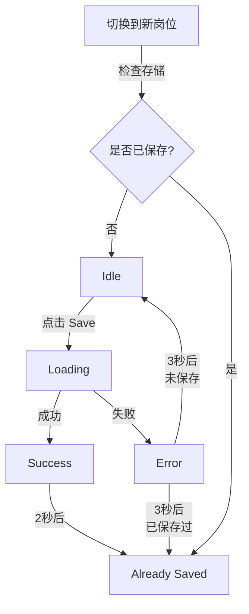

# 🎯 已保存岗位追踪功能

## ✨ 新功能

现在扩展会**记住**您已经保存过的岗位,并在界面上清晰标记!

---

## 🎨 视觉状态

### 1. **未保存** (Idle)
- **颜色**: 蓝色 (`#2563eb`)
- **图标**: ➕ Plus
- **文字**: "Save to CareerMatch"
- **可点击**: ✅

### 2. **保存中** (Loading)
- **颜色**: 浅蓝色 (`#dbeafe`)
- **图标**: 🔄 Loader (旋转动画)
- **文字**: "Saving..."
- **可点击**: ❌

### 3. **刚保存成功** (Success)
- **颜色**: 绿色 (`#16a34a`)
- **图标**: ✓ Check
- **文字**: "Saved!"
- **持续时间**: 2 秒后自动变为"Already Saved"

### 4. **已保存** (Already Saved) ⭐ **新增**
- **颜色**: 灰色 (`#6b7280`, 75% 不透明度)
- **图标**: ✓✓ CheckCheck (双勾)
- **文字**: "Already Saved"
- **可点击**: ❌ (已禁用,避免重复保存)
- **持久化**: 即使关闭浏览器再打开,仍然显示此状态

### 5. **错误** (Error)
- **颜色**: 红色 (`#dc2626`)
- **文字**: "Error: [错误信息]"
- **持续时间**: 3 秒后自动恢复(如果之前保存过则恢复为"Already Saved",否则为"Idle")

---

## 🔄 状态转换流程



---

## 💾 存储机制

### 存储位置
- **Chrome Storage API** (`chrome.storage.local`)
- **Key**: `"saved-jobs"`
- **Value**: `string[]` (岗位 ID 数组)

### 岗位 ID 格式
```typescript
// Seek 示例
"seek-74421583"  // 从 URL /job/74421583 提取

// LinkedIn 示例  
"linkedin-1234567890"  // 从 URL /jobs/view/1234567890 提取
```

### 数据持久化
- ✅ 浏览器关闭后**不会丢失**
- ✅ 插件禁用/启用后**不会丢失**
- ❌ 卸载插件后**会清空**

---

## 🧪 测试场景

### 场景 1: 首次保存
1. 访问一个新岗位
2. 按钮显示: **蓝色 "Save to CareerMatch"**
3. 点击保存
4. 按钮变为: **绿色 "Saved!"** (2秒)
5. 自动变为: **灰色 "Already Saved"**

### 场景 2: 切换到已保存岗位
1. 在搜索页点击左侧列表中的不同岗位
2. 如果岗位已保存,按钮**立即**显示为**灰色 "Already Saved"**
3. 如果岗位未保存,按钮显示为**蓝色 "Save to CareerMatch"**

### 场景 3: 刷新页面
1. 保存一个岗位
2. 刷新页面 (F5)
3. 按钮仍然显示为**灰色 "Already Saved"** ✅

### 场景 4: 关闭浏览器再打开
1. 保存若干岗位
2. 关闭 Chrome
3. 重新打开,访问已保存的岗位
4. 按钮仍然显示为**灰色 "Already Saved"** ✅

---

## 🔍 Console 日志

成功保存时:
```
🎯 [Extension] Found job detail container with: [data-automation="jobDetails"]
📦 [Extension] Extracted 45678 chars from container
🔵 [Background] Save job message received
🟢 [Background] API Response: { success: true, ... }
✅ [Extension] Marked job as saved: seek-74421583
```

切换到已保存岗位时:
```
🔄 [Extension] Job changed: seek-74421583 → seek-74433210
📌 [Extension] Job seek-74433210 was already saved
```

---

## 🛠️ 管理已保存列表

### 查看已保存岗位 (开发者工具)
```javascript
// 打开 DevTools Console
chrome.storage.local.get('saved-jobs', (result) => {
  console.log('Saved jobs:', result['saved-jobs'])
})
```

### 清空已保存列表 (开发者工具)
```javascript
// 如果需要清空重新测试
chrome.storage.local.set({'saved-jobs': []}, () => {
  console.log('Cleared saved jobs list')
})
```

---

## 📊 优势

1. **避免重复保存** - 已保存的岗位会被标记,不会重复点击
2. **快速浏览** - 在搜索页快速识别哪些岗位已经处理过
3. **持久化记忆** - 不会因为刷新或关闭浏览器而丢失状态
4. **智能跟踪** - 自动检测 URL 变化,实时更新状态
