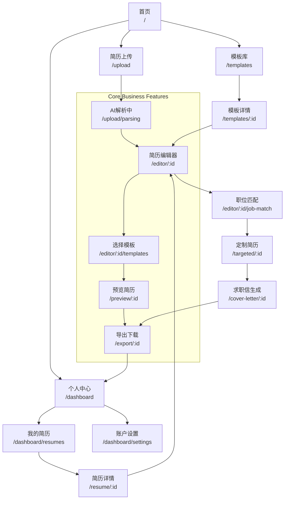

# User Flow — ResumeAI Pro

```mermaid
graph TD
  %% Primary Pages (accessible from main navigation)
  Home["首页<br/>/"]
  Upload["简历上传<br/>/upload"]
  Templates["模板库<br/>/templates"]
  Dashboard["个人中心<br/>/dashboard"]

  %% Upload Flow - Core Business Feature
  Home --> Upload
  Upload --> Parsing["AI解析中<br/>/upload/parsing"]

  subgraph "Core Business Features"
    Parsing --> Editor["简历编辑器<br/>/editor/:id"]
    Editor --> TemplateSelect["选择模板<br/>/editor/:id/templates"]
    TemplateSelect --> Preview["预览简历<br/>/preview/:id"]
    Preview --> Export["导出下载<br/>/export/:id"]
  end

  %% Template Library Flow
  Home --> Templates
  Templates --> TemplateDetail["模板详情<br/>/templates/:id"]
  TemplateDetail --> Editor

  %% Job-Specific Generation
  Editor --> JobMatch["职位匹配<br/>/editor/:id/job-match"]
  JobMatch --> TargetedResume["定制简历<br/>/targeted/:id"]
  TargetedResume --> CoverLetter["求职信生成<br/>/cover-letter/:id"]

  %% Dashboard Management
  Home --> Dashboard
  Dashboard --> MyResumes["我的简历<br/>/dashboard/resumes"]
  Dashboard --> Settings["账户设置<br/>/dashboard/settings"]

  MyResumes --> ResumeDetail["简历详情<br/>/resume/:id"]
  ResumeDetail --> Editor

  %% Cross-page Navigation
  Export --> Dashboard
  CoverLetter --> Export
```